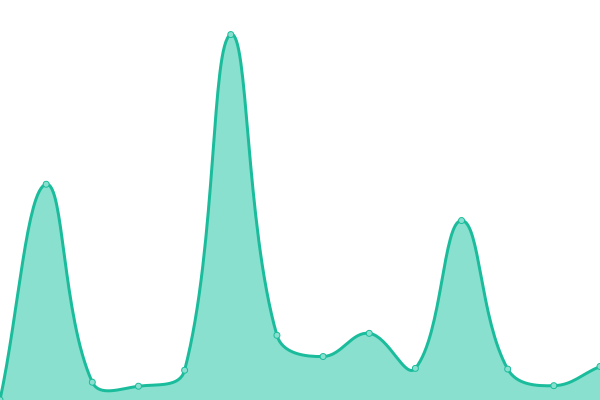
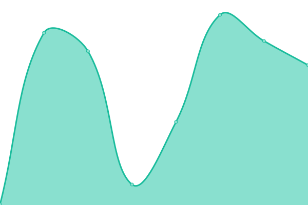
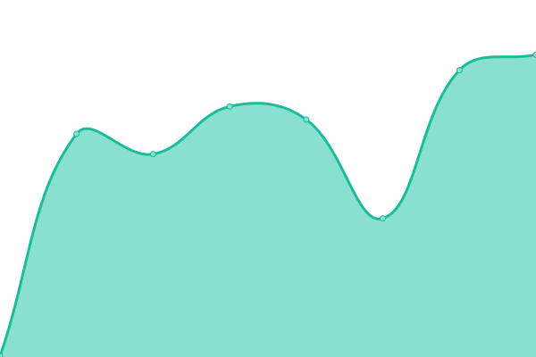

# [📈 Live Status](https://status.wanderer.moe): <!--live status--> **🟧 Partial outage**

This repository contains the open-source uptime monitor and status page for [wanderer.moe](https://wanderer.moe/), powered by [Upptime](https://github.com/upptime/upptime).

With [Upptime](https://upptime.js.org), you can get your own unlimited and free uptime monitor and status page, powered entirely by a GitHub repository. We use [Issues](https://github.com/wanderer-moe/status/issues) as incident reports, [Actions](https://github.com/wanderer-moe/status/actions) as uptime monitors, and [Pages](https://status.wanderer.moe) for the status page.

<!--start: status pages-->
<!-- This summary is generated by Upptime (https://github.com/upptime/upptime) -->
<!-- Do not edit this manually, your changes will be overwritten -->
<!-- prettier-ignore -->
| URL | Status | History | Response Time | Uptime |
| --- | ------ | ------- | ------------- | ------ |
|  [wanderer.moe](https://wanderer.moe) | 🟥 Down | [wanderer-moe.yml](https://github.com/wanderer-moe/status/commits/HEAD/history/wanderer-moe.yml) | 

 1453ms
     
 | 

<a href="https://status.wanderer.moe/history/wanderer-moe">99.08%</a>
    

|  [api](https://api.wanderer.moe) | 🟩 Up | [api.yml](https://github.com/wanderer-moe/status/commits/HEAD/history/api.yml) | 

 233ms
     
 | 

<a href="https://status.wanderer.moe/history/api">100.00%</a>
    

|  [cdn](https://cdn.wanderer.moe) | 🟩 Up | [cdn.yml](https://github.com/wanderer-moe/status/commits/HEAD/history/cdn.yml) | 

 365ms
     
 | 

<a href="https://status.wanderer.moe/history/cdn">100.00%</a>
    

<!--end: status pages-->

[**Visit our status website →**](https://status.wanderer.moe)

## 📄 License

- Powered by: [Upptime](https://github.com/upptime/upptime)
- Code: [MIT](./LICENSE) © [wanderer.moe](https://wanderer.moe/)
- Data in the `./history` directory: [Open Database License](https://opendatacommons.org/licenses/odbl/1-0/)
